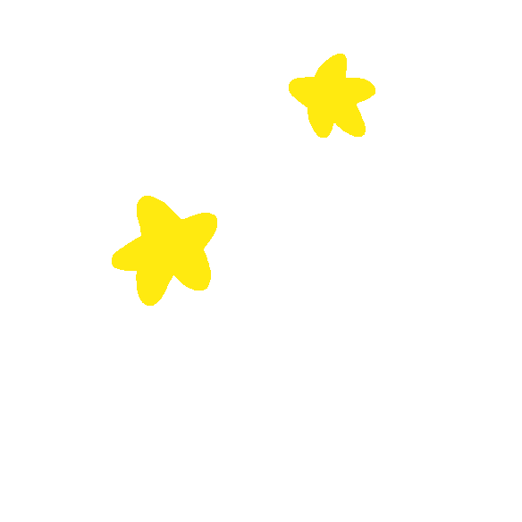

<h1>
  
  Hi, I'm Anis!&nbsp;
</h1>

<h3>🔗 About Me</h3>

I'm currently a student and I've recently started learning coding as a hobby.

I am exploring the world of programming, trying to build small projects, and enjoying the process of learning how things work behind the scenes. Every day is a new opportunity to write better code and learn something new!

 

<h3>📊 GitHub Stats</h3>

  

  

  

  

<h3>🐍 Contribution Snake</h3>

  <picture>
    <source media="(prefers-color-scheme: dark)" srcset="https://raw.githubusercontent.com/anis-mondal/anis-mondal/output/github-contribution-grid-snake-dark.svg?v=3">
    <source media="(prefers-color-scheme: light)" srcset="https://raw.githubusercontent.com/anis-mondal/anis-mondal/output/github-contribution-grid-snake.svg?v=3">
    
  </picture>

  
  
 
  

    <a href="https://git.io/typing-svg">
      <picture>
        <source media="(prefers-color-scheme: dark)" srcset="https://readme-typing-svg.demolab.com?font=system-ui&pause=1000&color=F7F7F7&width=450&height=40&center=true&lines=Thanks+for+visiting+my+profile+%E2%9D%A4%EF%B8%8F">
        <source media="(prefers-color-scheme: light)" srcset="https://readme-typing-svg.demolab.com?font=system-ui&pause=1000&color=1F2328&width=450&height=40&center=true&lines=Thanks+for+visiting+my+profile+%E2%9D%A4%EF%B8%8F">
        
      </picture>

  

